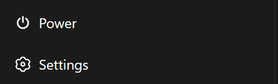
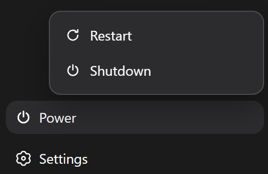
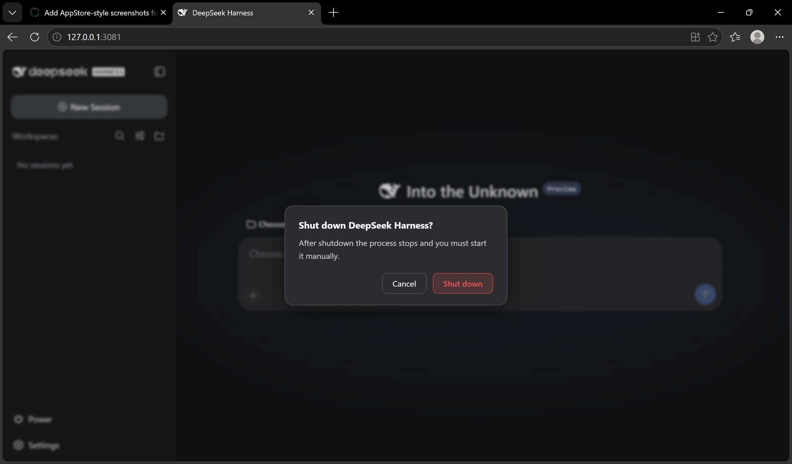
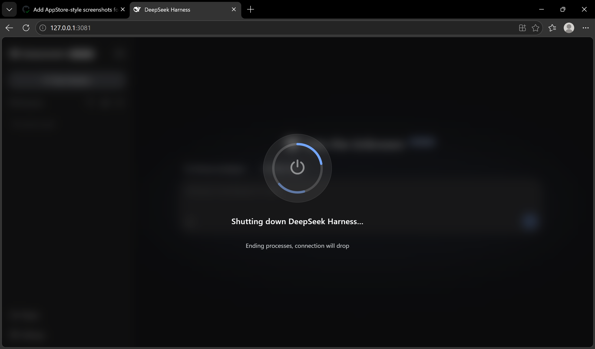

# dsh-power-button

[](LICENSE)
[](https://github.com/deepseek-ai/DeepSeek-Harness)

[English](README.md) | [中文](README.zh-CN.md)

A self-contained **power & lifecycle controller** for [DeepSeek Harness](https://github.com/deepseek-ai/DeepSeek-Harness): a sidebar power button with a Restart / Shutdown menu and a full-screen transition overlay. The restart/shutdown engine is built into the plugin — no third-party dependencies.

> Developed with DeepSeek AI assistance; reviewed before release.

## Features

- **Sidebar power button** in the footer action slot, theme-aware and styled to match the adjacent Settings trigger.
- **Restart / Shutdown menu** with a Windows-style full-screen transition overlay; the page auto-reloads after a confirmed restart.
- **Self-contained restart engine**: writes a detached `.cjs` helper that waits for the old process to exit and the port to free, then relaunches DSH with the same `execPath/execArgv/argv/cwd`. No PowerShell, no `taskkill`.
- **`/restart` and `/shutdown` commands**, plus a **`restart_harness` model tool** (same name as `anweat/dsh-restart`; registration is skipped when another plugin already owns the name).
- **Localized UI and host notices** (zh / en), following the profile's `locale.preference`.
- **Startup housekeeping**: `restart-helper-*.log` files older than 7 days are pruned from the runtime directory.

## Screenshots

**① Sidebar power button** — a theme-aware footer entry, styled to match the adjacent Settings trigger.



**② Restart / Shutdown menu** — opens from the power button; two actions, one click away.



**③ Shutdown confirm dialog** — guard against accidental shutdowns: the default focus sits on **Cancel**, and only an explicit confirm actually stops the process.



**④ Shutdown progress overlay** — a Windows-style full-screen transition showing the current stage while the process winds down.



**⑤ Restart completed toast** — after the page auto-reloads, a success notice confirms DSH is back.


## Install

```sh
dsh plugin --profile web add "github:keyiadiannao/dsh-power-button#master"
```

Restart DSH; a power button appears in the sidebar footer. Requires Node ≥ 22.19.

## Configuration

The plugin is configured through the profile's cordis layer (`cordis.patch.yml` or the settings UI):

| Key | Default | Meaning |
|---|---|---|
| `enableModelTool` | `true` | Register the `restart_harness` model tool. Set `false` to keep restart exclusively on the GUI button and `/restart`. |
| `maxDelayMs` | `5000` | Upper bound (ms) for the model tool's `delayMs` argument. The effective floor is 1000 ms. |

Example:

```yaml
- id: dsh-power-button
  config:
    enableModelTool: true
```

## How it works

```
click power → menu → Restart
[host]    POST /api/dsh-power-button/restart
          → write ~/.dsh/restart-helper-<pid>-<ts>.cjs
          → spawn `node <helper>` (detached, windowsHide)
[helper]  wait for old PID to exit → wait for port to free
          → spawn DSH again with same execPath/argv/cwd → self-delete
[host]    terminate after the HTTP response flushes
[client]  poll health → confirm new instanceId → auto reload
```

Shutdown posts `/api/dsh-power-button/shutdown` and terminates without relaunching. Because it is irreversible (the process must be started manually), the GUI **confirms shutdown in a dialog** before it fires — a second click is required. (`/shutdown` and the model tool remain single-action by design; the model never exposes shutdown.)

Design notes (from real issues hit during development):

- The helper must run **outside the process tree** (`detached` + `unref`), otherwise terminating DSH kills the helper mid-flight.
- The helper is a **real `.cjs` file**, not `node -e`: multi-line `node -e` scripts are mangled by Windows `CreateProcess` and die with a silent `SyntaxError`.
- Restart success is confirmed by a per-process `instanceId` that must **change** (old → new), so a brief outage alone never fakes success.
- **Durable-write quiescence**: after the old process exits and the port frees, the helper polls every session log's `(size, mtimeMs)` until two consecutive samples are identical (bounded at ~15s) before relaunching. The old process's session write-behind buffer can keep draining after its main loop exits; relaunching into a file that is still being appended interleaves stale seq numbers and corrupts the session — this check closes that window.

## Safety

- Destructive POSTs are protected by a **same-origin / loopback guard** (CSRF): the socket must be loopback, `Host` must be a loopback authority, and a browser `Origin` must match.
- An **at-most-once latch** rejects duplicate transitions (a concurrent second POST gets `409`).
- The model tool's `delayMs` is **floored at 1000 ms** — the model cannot kill the process before its own turn settles.
- The restart marker is **consumed (deleted) on boot**, so a later ordinary launch never misreports a restart.
- Command-line logging is **redacted** (credentials never reach `~/.dsh/restart-helper-<pid>.log`); helper and marker files are written `0600`, the runtime directory `0700`.

## Restart confirmation — UI toast, never written into a session

After a successful restart the plugin shows a small localized toast
("Restarted" / "已重启" depending on the UI language) in the corner of the UI.
This is **purely a UI notice**: nothing is written into any session log. (This
replaced an earlier design that
appended a synthetic `assistant/message` (`turn: 0, step: 0`) into the resumed
conversation — that approach tripped the token-meter's step-pairing invariant
and could corrupt large sessions, so it was removed. Tracked upstream:
[deepseek-ai/DeepSeek-Harness#802](https://github.com/deepseek-ai/deepseek-harness/discussions/802).)

Mechanics:
- On boot, if the restart marker was consumed, `/health` reports
  `restarted: true, fromInstanceId: <old>`.
- The client checks `/health` once after load; when `restarted` is true it
  shows the toast, then ACKs via `POST /api/dsh-power-button/notice-shown`
  so a later refresh does not re-show it.
- Because the confirmation never touches a session file, a restart can no
  longer corrupt session logs or leave unpaired events behind.

## Development

```sh
npm run build        # tsdown: host + client bundle
npm run typecheck    # tsc --noEmit
npm test             # vitest: marker lifecycle, delayMs clamp, argv redaction, log pruning
```

Tests isolate `DSH_HOME` via a vitest setup file, so they never touch your
real `~/.dsh`. Artifacts: host at `lib/index.js`, client bundle at
`lib/client.js` (both committed — git installs are build-free).

## License & Attribution

MIT. The "detached helper relaunch" idea follows [anweat/dsh-restart](https://github.com/anweat/dsh-restart) (MIT); the implementation is independently written (real `.cjs` file, no PowerShell, dynamic port), no code copied.
