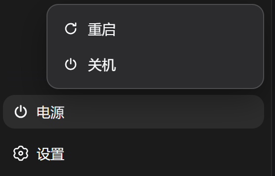
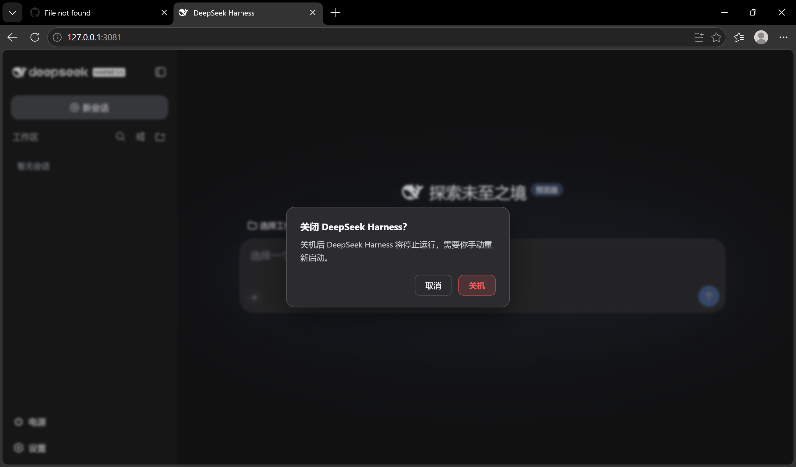
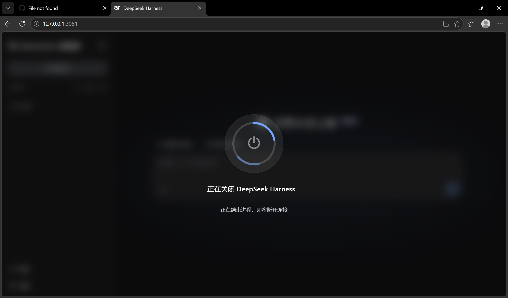
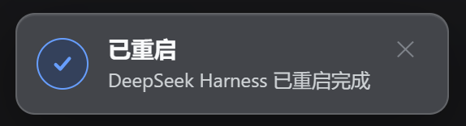

# dsh-power-xc

[](LICENSE)
[](https://github.com/deepseek-ai/DeepSeek-Harness)

[English](README.md) | [中文](README.zh-CN.md)

[DeepSeek Harness](https://github.com/deepseek-ai/DeepSeek-Harness) 的自包含**电源与生命周期控制**插件:侧边栏底部**电源按钮** + 上拉**刷新/重启/关机**菜单 + 全屏过渡动画。重启/关机引擎内置在本插件中,**不依赖第三方插件**。

> 本插件基于 [dsh-power-button](https://github.com/keyiadiannao/dsh-power-button) 开发，在其基础上进行了改进和优化。

> 由 DeepSeek AI 辅助开发,发布前经人工 review。

## 功能

- **侧边栏电源按钮**:注册到页脚操作位(`sidebar.footer.action`),主题自适应,外观与旁边的"设置"按钮一致
- **刷新/重启/关机菜单** + Windows 关机风格全屏过渡动画;重启确认后页面自动刷新
- **刷新功能**:点击"刷新"菜单项即可刷新当前浏览器页面,用于页面状态异常时快速恢复,是比重启更轻量的操作
- **自包含重启引擎**:写一个 detached 的 `.cjs` helper,等旧进程退出、端口释放后,用相同的 `execPath/execArgv/argv/cwd` 重新拉起 DSH。不使用 PowerShell、不使用 `taskkill`
- **`/restart` 与 `/shutdown` 命令**,以及 **`restart_harness` 模型工具**(与 `anweat/dsh-restart` 同名;若名字已被其它插件占用则跳过注册)
- **界面与宿主文案本地化**(中文 / English),跟随 profile 的 `locale.preference`
- **启动清理**:自动清理运行目录下超过 7 天的 `restart-helper-*.log`

## 刷新 vs 重启

| 操作 | 刷新 | 重启 |
|------|------|------|
| 重载插件 | ❌ | ✅ |
| 重载配置 | ❌ | ✅ |
| 进程重启 | ❌ | ✅ |
| 页面刷新 | ✅ | ✅ |
| 适用场景 | 页面状态异常 | 配置/插件变更 |

**为什么需要刷新功能？**

- 当页面出现显示异常或响应迟缓时,刷新可以快速恢复
- 修改 DSH 设置后,刷新可以立即看到效果(部分设置需要重启)
- 相比重启,刷新是轻量级操作,不会中断当前的 agent 任务
- 刷新不会重新加载插件和配置,适合仅需更新页面状态的场景

## 截图

**① 侧边栏电源按钮** —— 主题适配的底部常驻入口，风格与相邻的设置按钮一致。


**② 刷新 / 重启 / 关机菜单** —— 点击电源按钮展开，三个动作一次到位。



**③ 关机确认对话框** —— 防误触设计：默认焦点在「取消」，只有显式确认才会真正停止进程。



**④ 关机进度遮罩** —— Windows 风格全屏过渡，进程收尾时显示当前阶段。



**⑤ 重启完成提示** —— 页面自动重载后，成功提示确认 DSH 已恢复。



## 安装

```sh
cd D:/workspace/dsh-power-xc && pnpm pack
dsh plugin --profile web add file:D:/workspace/dsh-power-xc/dsh-power-xc-0.1.0.tgz
```

重启 DSH 后生效:侧边栏底部出现电源按钮。需要 Node ≥ 22.19。

## 配置

通过 profile 的 cordis 层配置(`cordis.patch.yml` 或设置界面):

| 键 | 默认 | 含义 |
|---|---|---|
| `enableModelTool` | `true` | 注册 `restart_harness` 模型工具。设 `false` 则重启仅保留在 GUI 按钮与 `/restart`。 |
| `maxDelayMs` | `5000` | 模型工具 `delayMs` 参数的上限(ms)。有效下限为 1000 ms。 |

示例:

```yaml
- id: dsh-power-xc
  config:
    enableModelTool: true
```

## 工作原理

```
点击电源 → 菜单 → 刷新
[客户端] window.location.reload()
         ↓ (仅刷新浏览器页面，不重启进程)

点击电源 → 菜单 → 重启
[宿主]   POST /api/dsh-power-xc/restart
         → 写 ~/.dsh/restart-helper-<pid>-<ts>.cjs
         → spawn `node <helper>` (detached, windowsHide)
[助手]   等旧 PID 退出 → 等端口释放 → 用相同 execPath/argv/cwd 重新拉起 DSH → 自删
[宿主]   响应刷出后终止
[客户端] 轮询 health → 确认新 instanceId → 自动刷新
```

关机则 POST `/api/dsh-power-xc/shutdown`,终止且不拉起。由于关机不可逆(进程停止后需手动启动),GUI 在关机前会**弹确认对话框**,需要再次点击确认才执行。(`/shutdown` 命令与模型工具保持单次触发;模型不暴露关机。)

开发中踩过的坑:

- helper 必须**脱离进程树**(detached + unref),否则终止 DSH 时 helper 一起被杀
- helper 写成**真实 .cjs 文件**而非 `node -e`:多行 `node -e` 脚本会被 Windows `CreateProcess` 破坏成静默 `SyntaxError`
- 重启成功以**每次进程独立的 `instanceId` 变化**(旧→新)为准,短暂离线本身不算成功
- **持久写静止检查**:旧进程退出、端口释放后,helper 轮询所有会话日志的 `(size, mtimeMs)` 直到连续两次采样一致(上限约 15 秒)才重启。旧进程主循环退出后其会话写缓冲可能仍在落盘;在仍在追加的文件上拉起新进程会插入旧 seq 造成会话损坏——此检查封堵了这个窗口

## 安全

- 破坏性 POST 带 **同源/loopback 防护**(CSRF):socket 必须是 loopback、`Host` 必须是 loopback 权威、浏览器 `Origin` 必须匹配
- **at-most-once 锁**:并发重复触发会被拒绝(第二次返回 `409`)
- 模型工具 `delayMs` **下限 1000 ms**——模型无法在自身 turn 结束前杀掉进程
- 重启 marker 在启动时**消费即删除**,后续普通启动不会误报"重启过"
- 命令行日志**脱敏**(凭据不会进入 `~/.dsh/restart-helper-<pid>.log`);helper 与 marker 文件以 `0600` 写入,运行目录 `0700`

## 重启确认——纯 UI 提示,绝不写入会话

重启成功后,插件会在界面角落弹出一条本地化的 `已重启` / `Restarted`
toast。这是**纯 UI 提示**:不会向任何会话日志写入内容。(此前的设计会向
恢复的会话追加合成的 `assistant/message`(`turn: 0, step: 0`)——该方案会
触发 token-meter 的 step 配对不变量并可能损坏大会话,已移除。上游跟踪:
[deepseek-ai/DeepSeek-Harness#802](https://github.com/deepseek-ai/deepseek-harness/discussions/802)。)

机制:
- 启动时若消费到重启 marker,`/health` 会报告 `restarted: true, fromInstanceId: <old>`
- 客户端加载后查询一次 `/health`;若 `restarted` 为真则显示 toast,然后通过
  `POST /api/dsh-power-xc/notice-shown` 确认,避免刷新后重复弹出
- 由于确认消息完全不触碰会话文件,重启**不再可能损坏会话日志**或留下未配对事件

## 开发

```sh
npm run build        # tsdown:host + client bundle
npm run typecheck    # tsc --noEmit
npm test             # vitest:marker 生命周期、delayMs 下限、argv 脱敏、日志清理
```

测试通过 vitest setup 文件隔离 `DSH_HOME`,不会触碰真实的 `~/.dsh`。
产物:host 在 `lib/index.js`,client bundle 在 `lib/client.js`(均已入库,git 安装免构建)。

## License 与致谢

MIT。"detached helper 重新拉起"的思路参考了
[anweat/dsh-restart](https://github.com/anweat/dsh-restart)(MIT);
实现为独立编写(真实 .cjs 文件、无 PowerShell、动态端口),未复制其代码。

本插件基于 [dsh-power-button](https://github.com/keyiadiannao/dsh-power-button) 开发，感谢原作者的工作。
